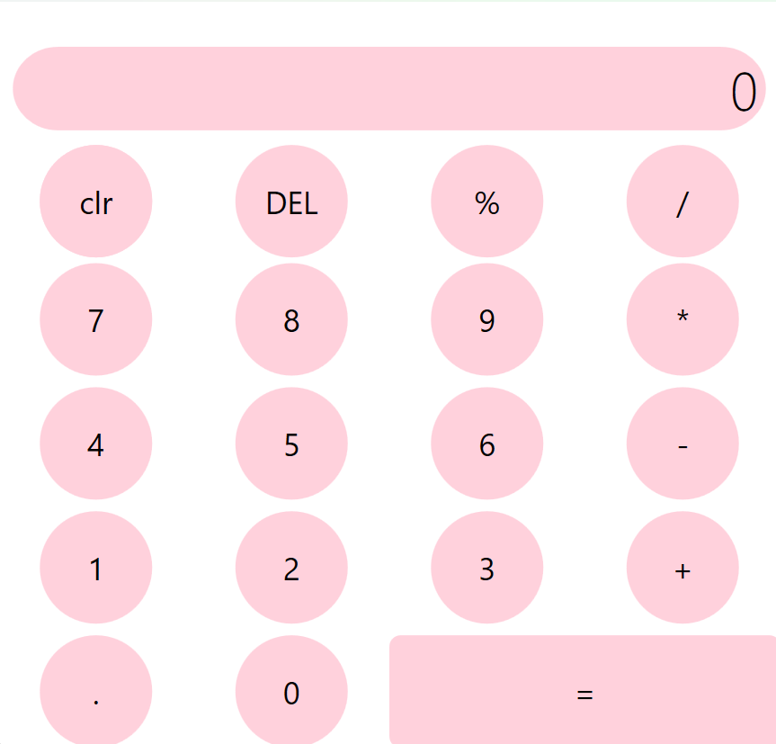

🌸 Modern Calculator (WPF)

Bu proje, C# ve WPF (Windows  Presentation Foundation) teknolojileri kullanılarak geliştirilmiş, estetik ve fonksiyonel bir hesap makinesi uygulamasıdır. Yazılım mühendisliği prensiplerine uygun olarak olay tabanlı (event-driven) bir mimariyle kodlanmıştır.

✨ Öne Çıkan Özellikler 

* İşlem Takibi: GecmisEkran (TextBlock) üzerinden yapılan işlemin tüm aşamaları (örn: 67 + 88) gri renkte şeffaf bir şekilde izlenebilir.

* Dinamik Arayüz: WPF'in güçlü Style ve ControlTemplate özellikleri kullanılarak butonlar tamamen yuvarlak ve modern bir forma kavuşturulmuştur.

* Hata Yönetimi: Sıfıra bölme gibi matematiksel hatalar kullanıcıya bildirilerek uygulamanın çökmesi engellenir.

* Gelişmiş Buton Fonksiyonları: * DEL: Yanlış girilen son rakamı siler.

  * clr: Tüm ekranı ve değişkenleri temizleyerek yeni işleme hazırlar.

  * %: Mevcut sayının anlık olarak yüzdesini hesaplar.

🛠 Teknik Detaylar

Stil ve Tasarım (XAML)

Projenin görsel kimliği tamamen XAML kaynakları üzerinden yönetilmektedir:

* Custom Templates: Standart buton yapısı CornerRadius="60" ile dairesel bir forma dönüştürülmüştür.

* Triggers: Eşittir butonu için özel bir stil tanımlanmış ve IsMouseOver tetikleyicisi ile etkileşimli bir kullanıcı deneyimi sağlanmıştır.

* Responsive Grid: Grid.ColumnDefinitions ve Grid.RowDefinitions kullanılarak bileşenlerin pencere boyutuna göre hizalanması sağlanmıştır.

Mantıksal Yapı (C#)

* Sayı Girişi: Numara_Click metodu ile noktadan (decimal) sonraki girişler ve yeni sayı geçişleri kontrol edilir.

* İşlem Operatörleri: Islem_Click metodu ile operatörler (+, -, *, /) atanır ve mevcut değer ilkSayi olarak hafızaya alınır.

* Sonuç Hesaplama: Esittir_Click metodu içinde switch-case yapısı kullanılarak matematiksel işlemler gerçekleştirilir.

🚀 Kurulum

Depoyu klonlayın:

git clone https://github.com/yagmurbekil2/calculator.git

Calculator.sln dosyasını Visual Studio ile açın.

Projeyi derleyin (Build) ve çalıştırın (Start).

